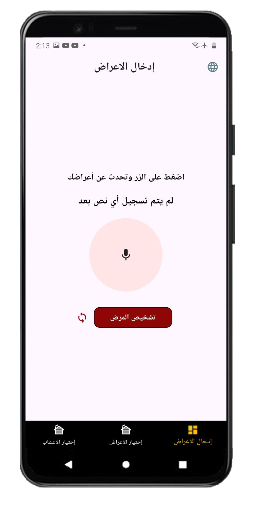
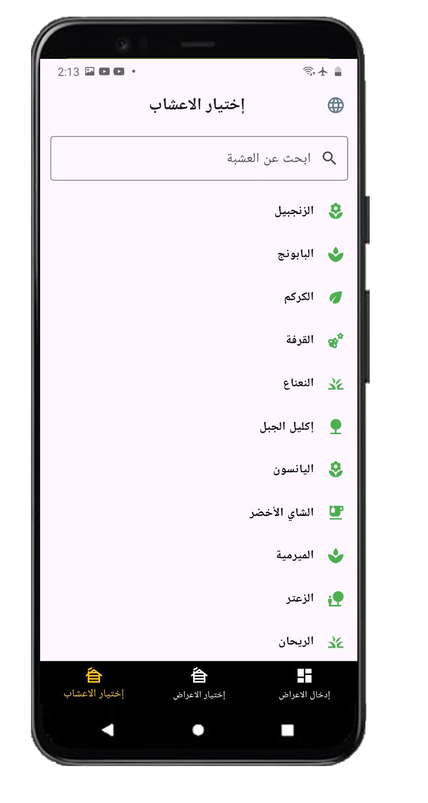
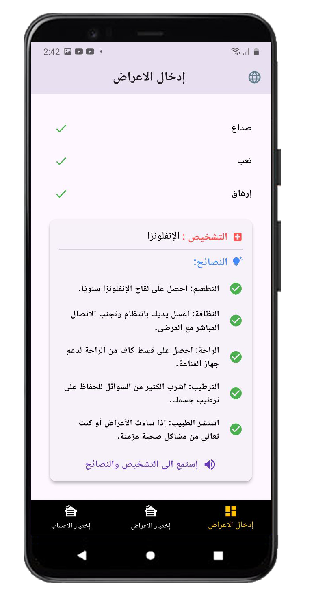

# 🩺 Disease Discovery App


AI-based disease detection using spoken or selected symptoms.

An Android application built with Flutter that allows users to input their symptoms via **voice** or **selection**, then predicts the possible disease using an MLP-based machine learning model, providing both **written** and **spoken results** along with recovery recommendations.

---

## 🎯 Project Goal

To provide health awareness and an initial automated prediction when a medical consultation is not immediately available.

---

## 📸 App Images

|  |  |  |  |
| ------------------------------ | ------------------------------ | ------------------------------ | ------------------------------ |
| Home Screen                    | Voice Input                    | Symptom Selection              | Herbs Selection                |

|  |  |  |  |
| ------------------------------ | ------------------------------ | ------------------------------ | ------------------------------ |
| Prediction Result              | Recovery Advice                | Animations                     | Benefits of the herb           |

---

## ✨ Features

- 🎤 **Speech-to-Text** symptom input
- 🤖 **Disease prediction** using MLPClassifier
- 🔊 **Voice feedback** with Text-To-Speech
- 🌍 Multi-language support with **Easy Localization**
- ✅ Clean Architecture + TDD + SOLID + **Bloc State Management**
- 📡 Online server communication for AI prediction
- 📱 Responsive UI with **ScreenUtil**
- 🎬 Stunning animations powered by **Lottie**
- 🔌 Dependency Injection with **get_it & injectable**
- 🌐 Internet connection detection

---

## 🧠 Machine Learning Backend

- Implemented with **Python & Scikit-learn**
- Dataset contains multiple symptoms mapped to disease prognosis
- Model used: `MLPClassifier` (Neural Network)
- Model saved and loaded using `joblib`

### Training Example

```python
import pandas as pd
from sklearn.preprocessing import LabelEncoder
from sklearn.neural_network import MLPClassifier
import joblib

# Load dataset
df = pd.read_csv('diseases_dataset.csv')
X = df.drop(columns=["prognosis"])
y = df["prognosis"]

# Encode labels
le = LabelEncoder()
y_encoded = le.fit_transform(y)

# Train MLP model
mlp_model = MLPClassifier(
    hidden_layer_sizes=(200, 100),
    activation='relu',
    solver='adam',
    max_iter=500
)

mlp_model.fit(X, y_encoded)

# Save model
joblib.dump(mlp_model, "disease_model.joblib")
```
